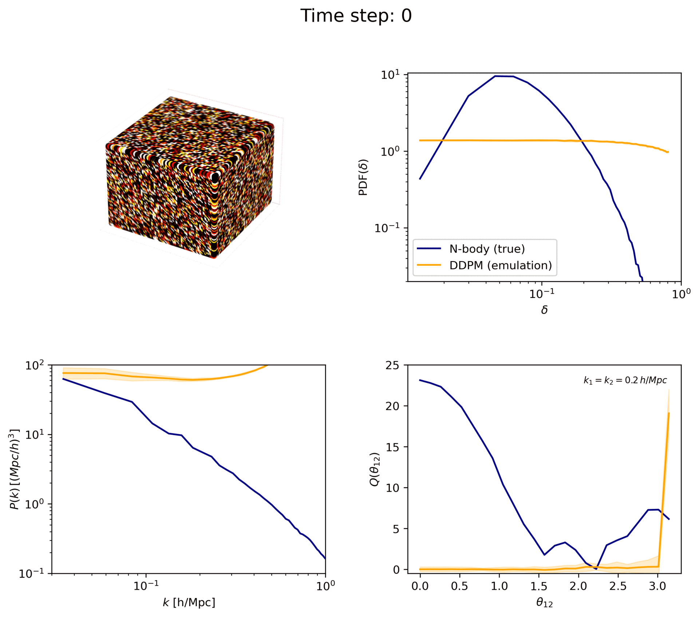

<h1 align="center"> Conditional generative models for generating 3D dark matter density fields </h1>

  <strong>Paper:</strong> <a href="https://arxiv.org/abs/" target="_blank"> Conditional diffusion models for generating 3D cosmic density fields:
applications to $𝑓(𝑅)$ cosmologies </a>

#Abstract
Next-generation galaxy surveys promise unprecedented precision in testing gravity at cosmological scales. However, realising this potential requires accurately modelling the non-linear cosmic web. We address this challenge by exploring conditional generative modelling to create 3D dark matter density fields via score-based (diffusion) and flow-based methods. Our results demonstrate the power of diffusion models to accurately reproduce the matter power spectra and bispectra, even for unseen configurations. They also offer a significant speed-up with slightly reduced accuracy when flow-based reconstructing the probability distribution function, but they struggle with higher-order statistics. To improve conditional generation, we introduce a novel multi-output model to develop feature representations of the cosmological parameters. Our findings offer a powerful tool for exploring deviations from standard gravity, combining high precision with reduced computational cost, thus paving the way for more comprehensive and efficient cosmological analyses

<kbd>
  
</kbd>

